<div align="center">



<br />

<a href="https://github.com/nanda-81/JobSearchingAgent"></a>
<a href="https://github.com/nanda-81/CALAMITI"></a>
<a href="https://github.com/nanda-81"></a>

### Nanda Kishore · software engineer in progress

I build useful software end to end: interfaces, APIs, data flows, and experiments that turn a problem into something people can try. I’m looking for SDE opportunities and beginner-friendly open-source collaboration.

<a href="https://drive.google.com/file/d/1NOhUnDU6nXKKKYi1tIuC5PIz3EicXFl5/view">RESUME</a> ·
<a href="https://www.linkedin.com/in/nanda-k-1b736a270/">LINKEDIN</a> ·
<a href="mailto:nellutlanandakishore@gmail.com">EMAIL</a> ·
<a href="https://github.com/nanda-81?tab=repositories">ALL REPOSITORIES</a>

</div>

<table>
<tr>
<td width="33%"><b>⚡ CURRENTLY BUILDING</b><br/><br/>Product-shaped full-stack projects with APIs, dashboards, and clearer documentation.</td>
<td width="33%"><b>🧠 CURRENTLY LEARNING</b><br/><br/>Testing, system thinking, Git workflows, and how to make a useful first open-source contribution.</td>
<td width="33%"><b>🛰️ CURRENTLY SEEKING</b><br/><br/>SDE opportunities, thoughtful feedback, and beginner-friendly repositories to contribute to.</td>
</tr>
</table>

<!-- PROFILE:GENERATED:START -->
## Live profile signal

**13** public repositories · **3** stars · **0** forks

**Now building:** Building practical full-stack products and learning how to contribute well to open source.
**Now learning:** Make a first focused documentation or bug-fix contribution with tests and a clear pull request.

<sub>Public GitHub snapshot refreshed 2026-07-14. Activity metrics are evidence, not the identity.</sub>
<!-- PROFILE:GENERATED:END -->

## `01` / FEATURED BUILDS

<table>
<tr>
<td width="50%" valign="top">

### ◒ PJSAP
**Job Search Automation Platform**

**Problem** · Job discovery is fragmented and noisy.  
**Build** · Crawling, matching, APIs, and a dashboard flow.  
**Signal** · Full-stack product thinking and information retrieval.

`Python` `FastAPI` `React` `TypeScript` `Docker`

<a href="https://github.com/nanda-81/JobSearchingAgent">VIEW REPOSITORY →</a>

</td>
<td width="50%" valign="top">

### ◉ MINDCARE
**Conversational AI experiment**

**Problem** · Make supportive interactions feel more human and accessible.  
**Build** · React interface, Node services, Dialogflow, and Gemini integration.  
**Signal** · AI product boundaries and responsible UX thinking.

`React` `Node.js` `Dialogflow` `Gemini`

<a href="https://github.com/nanda-81/MindCare-ChatBot">VIEW REPOSITORY →</a>

</td>
</tr>
<tr>
<td width="50%" valign="top">

### ◌ CALAMITI
**MRI image harmonization research build**

An applied deep-learning exploration of image harmonization, reproducible notebooks, visual outputs, and the relationship between model results and data quality.

`Python` `PyTorch` `Jupyter` `Colab`

<a href="https://github.com/nanda-81/CALAMITI">VIEW REPOSITORY →</a>

</td>
<td width="50%" valign="top">

### ⌘ HUFFMAN-CODING
**Compression from first principles**

Frequency analysis → tree construction → binary encoding → decompression. A compact algorithms project with a clear input/output story.

`C++` `Algorithms` `File I/O`

<a href="https://github.com/nanda-81/Huffman-Coding">VIEW REPOSITORY →</a>

</td>
</tr>
</table>

### `05` / FARM-AI

An ML-backed agricultural management concept exploring crop recommendation, yield prediction, crop information, and Hindi/English access.

`React` `Flask` `Firebase` `TensorFlow` `scikit-learn` · <a href="https://github.com/nanda-81/Farm-AI">VIEW REPOSITORY →</a>

## `02` / ENGINEERING LOADOUT

```text
PRODUCT       React · TypeScript · JavaScript · HTML · CSS
BACKEND       Python · FastAPI · Flask · Node.js · REST APIs
AI / ML       PyTorch · TensorFlow · scikit-learn · NumPy · Pandas
FOUNDATIONS   C++ · algorithms · data structures · SQL · file systems
DELIVERY      Docker · GitHub Actions · Jupyter · Colab · Firebase
```

## `03` / OPEN-SOURCE TRANSMISSION

```text
STATUS        ENTERING THE ECOSYSTEM
MISSION       Make one focused, useful contribution with a clear diff.
FIRST TARGET  Documentation, tests, reproducible bug reports, or a small fix.
PROTOCOL      Read the guide → reproduce → change less → test → explain → listen.
```

I’m starting open source deliberately. I want to learn the conventions before trying to make a large change: how maintainers communicate, how issues become patches, how tests protect a project, and how to respond well when review changes my approach.

## `04` / FIELD NOTES

> **001** · A project becomes easier to trust when another person can run it.  
> **002** · AI features need boundaries, not just API calls.  
> **003** · A good pull request reduces the maintainer’s thinking cost.

## `05` / CONTACT TERMINAL

```text
nanda-81@build-system:~$ echo "open to SDE opportunities and thoughtful collaboration"
open to SDE opportunities and thoughtful collaboration

nanda-81@build-system:~$ ./connect
→ linkedin  https://www.linkedin.com/in/nanda-k-1b736a270/
→ resume    https://drive.google.com/file/d/1NOhUnDU6nXKKKYi1tIuC5PIz3EicXFl5/view
→ email     nellutlanandakishore@gmail.com
```

<div align="center">

_Ship small. Explain clearly. Contribute carefully._

</div>
